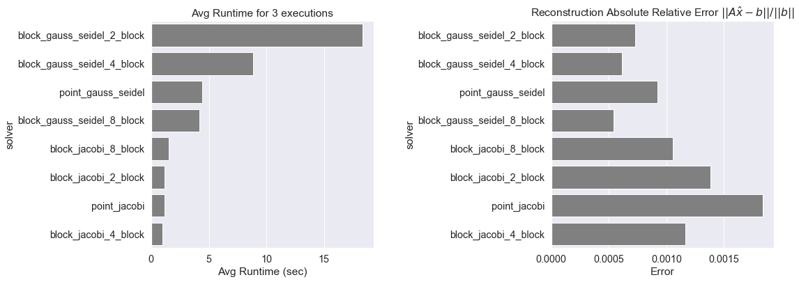

# Iterative and Block Iterative Numerical Methods

This repo has been developed during my studies in Athens Univeristy of Economics and Business for the MSc Data Science program. It contains implementations of the three main iterative numerical methods, namely

* Jacobi
* Gauss-Seidel
* Successive Overelaxation method (SOR)

In addition, the **block** methods of Jacobi and Gauss Seidel were implemented. When compared in terms of performance, the block Jacobi method seems to outperform all other methods.

Here is a short overview of the maths behind these iterative methods. 

## 1. Jacobi

